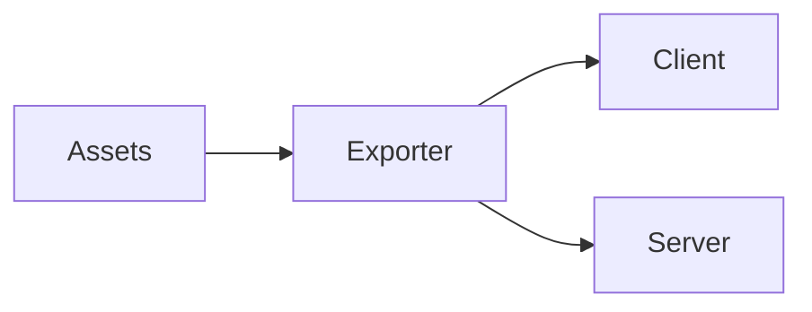

# Reconquer Engine


🚨 **IMPORTANT:** Before using or contributing, please read the [LICENSE](LICENSE) and [CONTRIBUTOR LICENSE AGREEMENT](CONTRIBUTOR_LICENSE_AGREEMENT.md). Commercial users may have to pay a royalty if they use this software to generate a gross income over $100,000.

## Overview

Reconquer Engine is an MMORPG game engine and framework for creating games with mechanics somewhat similar to Old School Runescape (OSRS). It is currently used for the game [Reconquer Online](https://news.reconquer.online/). This repository contains not only the engine files, but also all the assets for running a local copy of Reconquer Online!

It uses native web technology for user interfaces and (**three.js**) for graphics and therefore runs in a browser or an electron app. The backend uses **Express** and **Socket.io** for a server and real time communication. The exporter, which combines game assets and generates server and client configs, uses **gltf-transform**.

This version uses a simple local file database and simple authentication system that should generally be replaced in production deployments.

## Architecture

1. **Assets**: Contains all game assets.
2. **Exporter**: Processes and optimizes assets.
3. **Client**: Contains browser client code.
4. **Server**: Node.js server using express and socket.io.

### How It Looks:


## Getting Started

1. **Clone the repository:**
   ```bash
   git clone https://github.com/your-username/reconquer-engine.git
   cd reconquer-engine
   ```
2. **Install dependencies:**
   ```bash
   npm install  # Install dependencies in the root directory
   cd exporter
   npm install  # Install dependencies in the exporter directory
   ```
3. **Start the exporter server:**
   ```bash
   npm start  # Run this inside the exporter directory
   ```
4. **Start the development environment:**
   ```bash
   cd ..  # Move back to the root directory
   npm run watch  # Start file watching
   npm run dev  # Start the development server
   ```
5. **Access the application:**

Open your web browser and navigate to http://localhost:3000 to view the application.

## Contributing

We welcome contributions for the engine itself and for Reconquer Online! Before submitting a pull request, please:

- Agree to the Contributor License Agreement ([Contributor License Agreement](Contributor_License_Agreement.md)).

## License

Reconquer Engine is licensed under a custom license. See the [LICENSE](LICENSE.md) file for details.

## Community & Support

- 📢 **Discord**: [Join our community](https://discord.gg/5VqPUfdMn9)
- 🛠 **Report Issues**: [GitHub Issues](https://github.com/ReconquerOnline/reconquer-engine/issues)
- 🌱 **Feature Requests**: Submit ideas in the discussions tab

🚀 **Happy building!**